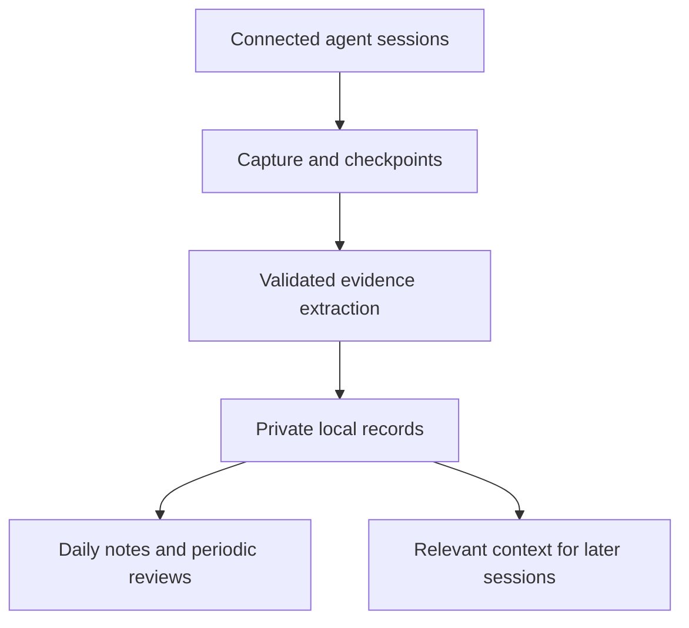

# Engineering Development Workspace

Turn everyday AI-assisted work into a clearer understanding of what you know, what you are learning, and what to practice next.

This project is a personal engineering journal and development workspace. Its intended workflow captures learning evidence from connected AI sessions, organizes it into concise daily notes, and uses that history to support reflection, focused practice, and continuity across sessions.

**Status:** first implementation slice: offline records and daily rendering. Automatic Codex capture, inference, coaching, context retrieval, and weekly/monthly reviews are still planned. The full MVP is not complete and no release has been published. The project name is still being decided.

## Why I’m building this

I started working in software development with little day-to-day technical guidance. Much of what I learned came from solving real problems as they appeared. That gave me practical experience, but it also left questions that are difficult to answer alone:

- Am I understanding the underlying concepts, or becoming familiar with a particular solution?
- Where am I improving, and what evidence supports that?
- Which recurring difficulties deserve focused study?
- Could I have reached a better conclusion through a different reasoning process?
- What should I practice next?

Conversations with friends, peers, and mentors are an important part of how I learn. I want a place to examine my work, recognize progress, and organize my questions so those ongoing conversations have useful context. Keeping a record of my reasoning and uncertainties can help me discuss ideas, seek feedback, and reflect on different perspectives.

The inspiration is partly the habit of reflection found in Marcus Aurelius’s *Meditations*: return to your actions, examine your judgment, and decide how to improve. Here, that reflection centers on engineering decisions and learning. Progression systems in RPGs offer another influence: make growth visible through meaningful challenges and milestones.

I am building this for my own use first, and sharing the software so other developers can adapt it to their goals. Its value should come from useful feedback and better understanding, with evidence behind both.

## What the experience should look like

You work with a connected agent as usual. You ask questions, investigate failures, consider alternatives, and implement changes. The integration records relevant evidence and updates your notes without requiring you to remember an end-of-day writing ritual.

The daily note gives you a short overview. Expandable sections preserve the reasoning needed to understand your decisions and revisit your learning. You can add your own reflection at any time; when it is absent, the system says so.

Weekly reviews help choose one or two practical learning actions. Monthly assessments compare evidence over time and revisit your priorities. Later sessions can retrieve relevant goals, decisions, and reviewed lessons from the same private workspace.

The intended cycle is:

**Work → capture evidence → reflect → practice → revisit the evidence.**

## Try the offline journal

The current CLI initializes a private directory, imports normalized synthetic
evidence, renders daily Markdown, and reports record counts and note conflicts.
It does not read Codex history or call a model. Reimporting identical evidence is
safe; conflicting identities are reported instead of silently replaced.

From this checkout, use Python >=3.10 on Linux/macOS:

```bash
python3 -m venv .venv
source .venv/bin/activate
python -m pip install .
meditations --help
```

Local verification currently uses Linux and Python 3.10.12. The CI matrix targets
Linux/macOS on Python 3.10 and 3.14; those CI results are pending. Prefer a supported
Python release for regular use.

Create a disposable example workspace outside the checkout:

```bash
MEDITATIONS_DEMO_DIR="$(mktemp -d)"
export MEDITATIONS_DEMO_DIR
meditations init --workspace "$MEDITATIONS_DEMO_DIR/notes" --timezone America/Sao_Paulo
python - <<'PY'
import json
import os
from pathlib import Path

demo = Path(os.environ["MEDITATIONS_DEMO_DIR"])
workspace_id = json.loads((demo / "notes/workspace.json").read_text())["workspace_id"]
records = [json.loads(line) for line in Path("examples/records.jsonl").read_text().splitlines()]
for record in records:
    record["workspace_id"] = workspace_id
(demo / "input.jsonl").write_text("".join(json.dumps(record) + "\n" for record in records))
PY
meditations import-records --workspace "$MEDITATIONS_DEMO_DIR/notes" --input "$MEDITATIONS_DEMO_DIR/input.jsonl"
meditations render --workspace "$MEDITATIONS_DEMO_DIR/notes"
meditations status --workspace "$MEDITATIONS_DEMO_DIR/notes"
```

Import reports `{"created": 3, "unchanged": 0}`; running it again reports
`{"created": 0, "unchanged": 3}`. Two daily notes appear under
`$MEDITATIONS_DEMO_DIR/notes/engineering/daily/`: `2026-10-03.md` and
`2026-10-04.md`, connected by task links. No login or inference is required.
The [sample daily note](examples/daily-note.md) shows the synthetic output.

Read those notes in your editor. Add reflection below the generated block and
rerun `render`; your text is preserved. Text inside the generated block is replaced.
Notes without exactly one valid pair of markers are left untouched and reported
as conflicts. Keep personal edits outside that block. Once finished, you can remove
the disposable directory printed by `echo "$MEDITATIONS_DEMO_DIR"`.

Configuration is stored in `workspace.json`; records are individual JSON files.
The first slice supports English, portable Markdown links, and HTML details.
Other presentation settings remain part of the full MVP. Source revisions must
use distinct record UUIDs; earlier revisions remain stored but only the latest
contributes to notes. Correct records by importing a new revision rather than
editing generated sections.

## First-release scope

The MVP includes the complete learning loop. We will build it in stages, then improve it through everyday usage.

| Included in the MVP | What you should be able to do |
| --- | --- |
| Automatic Codex capture | Work normally while new activity is processed; pause recording or exclude projects when needed |
| Daily Markdown journal | Read concise task sections, expand reasoning and evidence, and add a personal reflection that survives regeneration |
| Weekly and monthly reviews | Follow conclusions back to evidence, choose focused practice, and compare understanding over time |
| Contextual coaching | Choose Balanced, Focus, or Study mode during connected sessions |
| Continuity across sessions | Bring relevant goals, decisions, and reviewed lessons into later Codex sessions |
| Configurable presentation | Choose language, timezone, naming, tags, links, and expandable formatting, including an Obsidian preset |
| Linux/macOS and synchronized records | Use home and work installations with user-managed synchronization, deduplication, and visible conflicts |

The core will be a **Python command-line application**. Codex hooks and scheduled workers invoke it automatically; terminal commands also provide setup, processing status, retries, and manual reviews. You mainly interact with the resulting Markdown and coaching in Codex.

The selected initial inference route uses your **existing Codex login** through noninteractive Codex execution. Its authentication, unattended behavior, model availability, and usage limits still require verification. A separate API key is not an MVP requirement; saved login does not imply unlimited usage or access to every model.

Off-topic archiving, browser ChatGPT capture, additional integrations, dashboards, embeddings, and gamification remain outside this release. Incidental unrelated content in Codex sessions is excluded from engineering records and assessments.

## Understanding is the goal

The journal should preserve the technical concepts behind the work: the problem, assumptions, alternatives, trade-offs, and reasons for a decision. A line-by-line reconstruction of code is usually unnecessary for that purpose.

For example, a database migration record might discuss referential integrity, compatibility during deployment, and rollback strategy. It should explain why those concepts mattered and what understanding you demonstrated.

The system must distinguish these situations:

| Evidence | What it supports |
| --- | --- |
| The agent explains a concept | Learning material was available |
| You explain it in your own words | Evidence of conceptual understanding |
| You apply it successfully with guidance | Evidence of supported application |
| You diagnose a failure or apply it in a new context | Evidence of diagnosis or transfer |

A question can be thoughtful verification, curiosity, or a possible gap. The system should investigate the distinction rather than automatically judge it. Likewise, a lack of new evidence should not be reported as a lack of improvement.

## Notes that stay manageable

Daily synthesis is the default. Several sessions can contribute to the same day’s engineering note, with separate sections for distinct tasks.

Related questions stay with their context. If a database task leads to questions about architectural design, both belong in the engineering record. Later discussions of the same task can be linked across daily notes.

Relationships connect the history through task identifiers, section-level tags, and concept links. Recurring concepts can receive synthesis notes when useful.

### Illustrative daily entry

> **Database restructuring:** Compared migration approaches and explored referential integrity. Compatibility during deployment remains an open question.
>
> **Concepts:** Referential integrity, backward-compatible migrations
>
> **Tags:** database, architecture
>
> **Next learning action:** Explain what happens if the migration is interrupted between stages.

<details>
<summary>Reasoning and learning evidence</summary>

- **Context:** A structural change needed to preserve existing application behavior.
- **Reasoning:** Considered sequencing changes so older and newer application versions could coexist.
- **Attribution:** The agent introduced one migration approach; the user identified a compatibility concern.
- **Evidence:** The concern appeared before implementation. No completed migration or test result was available.
- **Uncertainty:** Rollback behavior was discussed but not demonstrated.

</details>

This is a synthetic example, not a record of actual work. Expansion format, links, tags, and filenames are configurable.

## Your directory, your tools

The first storage target is a local directory containing Markdown notes and structured evidence records. You decide where that directory lives and how to read or synchronize it.

Obsidian is an intended presentation option, with a locally configured preset for links and collapsible details. A text editor should also be sufficient. The initial workflow should not require a specific notes application or a hosted database.

An illustrative layout:

```text
<selected-directory>/
  profile/
  engineering/
    daily/
    reviews/
    concepts/
  records/
```

Work and personal installations can contribute to the same workspace through user-managed synchronization. Synchronizing files and installing the integration are separate operations. The application must reconcile available contributions, prevent duplicates, and preserve handwritten content. Conflicting edits should be surfaced rather than silently overwritten.

## Feedback that respects the work

Three coaching modes are planned:

| Mode | Intended behavior |
| --- | --- |
| Balanced | Brief feedback relevant to the current task; deeper learning in reviews |
| Focus | Defer coaching while continuing evidence recording |
| Study | More explanations, Socratic questions, and exercises |

Reviews should connect conclusions to supporting evidence, acknowledge uncertainty, and propose a small number of actionable priorities. Exercises need observable completion criteria: explain a trade-off, diagnose a failure, or demonstrate a behavior.

The workspace supports ongoing learning through conversations with friends, peers, and mentors. You can choose to share a concise review, your interpretation, and focused questions to discuss your reasoning and hear other perspectives. You decide what to share and with whom; sharing is not automatic.

## How the integration is intended to work

Codex is the first integration target. Agent-specific adapters isolate lifecycle events and conversation formats from the rest of the application.



Short lifecycle handlers checkpoint pending work. A worker processes new material, validates model output, and persists evidence. Ordinary application code renders the notes. Scheduled reconciliation and startup recovery handle pending work when the environment becomes available.

Skills guide the agent’s workflow; they do not independently provide scheduling or model execution. The core is a Python CLI targeting Linux and macOS, with existing Codex authentication as the selected inference route. The exact installation package, supported Python/Codex versions, and unattended execution behavior remain to be validated.

### Efficiency from the beginning

| Work | Intended executor |
| --- | --- |
| Checkpoints, deduplication, file writes, links, and rendering | Ordinary code |
| Topic classification and structured evidence extraction | A lower-cost model |
| Weekly and monthly assessment | A more capable model |
| Selected extraction failures or ambiguities | Bounded repair or escalation when justified |

Process new material incrementally instead of repeatedly summarizing the full history. Avoid an additional daily model call when the extracted records can be rendered directly.

Model selection should follow evaluations of attribution, conceptual completeness, topic boundaries, and uncertainty—not just fluent prose. Usage and latency should be measured. A stronger review model cannot recover evidence that extraction discarded.

## Privacy and assessment boundaries

The public repository contains software and synthetic examples. Your profile, notes, assessments, and credentials belong outside it.

Conceptual recording should minimize unnecessary code, identifying details, and confidential implementation information. The integration should avoid making additional raw transcript copies by default. Filtering and abstraction cannot guarantee perfect confidentiality, so uncertain passages should be omitted or marked as reduced evidence.

Local files do not imply local inference. The configured provider determines what material is submitted for processing; that behavior must be documented before use. Existing agent history has its own retention behavior.

Stored conversations and retrieved notes are treated as data. Embedded instructions must not change recording policies or trigger actions.

Assessments describe available evidence. They are not certifications of competence or comprehensive judgments of professional ability. Users must be able to correct records, disagree with interpretations, pause capture, and exclude material. Durable profile conclusions remain reviewable candidates before adoption.

## Development roadmap

These are planned milestones, not completed features. All five belong to the MVP; a records-only demo is an intermediate development checkpoint:

- [x] Local configuration, evidence records, and deterministic daily rendering (offline slice; broader presentation settings remain pending).
- [ ] Evaluated extraction, configurable model roles, and usage reporting.
- [ ] Codex capture, durable checkpoints, and reconciliation.
- [ ] Installation/update behavior and cross-machine conflict handling.
- [ ] Selective context retrieval, coaching modes, reviewed memory, and evidence-linked weekly/monthly reviews.

Future possibilities include additional agent and storage adapters, richer visualizations, and optional gamification grounded in demonstrated milestones.

The priority is a reliable feedback loop before expanding integrations or adding progression mechanics.

The [learning workspace architecture](docs/architecture/learning-workspace.md) documents the MVP scope, component boundaries, evidence contracts, recovery, privacy, and acceptance criteria. Temporary implementation plans and handoffs remain local. The open-source license remains to be selected before release.

## Development

Activate the project environment, then install the pinned development tools and
the editable package:

```bash
python -m pip install -r requirements-dev.txt
python -m pip install --no-build-isolation -e .
ruff check .
ruff format --check .
pyright
pytest
python -m build --no-isolation
```

Tests use temporary workspaces and synthetic evidence. Distribution artifacts
include reusable source and public documentation; the local handoff, credentials,
and user records must stay excluded. Notable changes are recorded in
[CHANGELOG.md](CHANGELOG.md). CI is configured but its platform results remain
unverified until run on GitHub.

## Contributing

The repository follows the documentation approach used in the owner's The Archives project: keep the README accurate to delivered behavior, maintain durable architecture documentation, and record notable changes in an `[Unreleased]` changelog as implementation begins. Temporary agent plans and private runtime data stay outside version control. Public examples and evaluation fixtures use synthetic data.

While the interfaces are evolving, useful contributions include synthetic evaluation cases, discussions of learning and assessment, reproducible synchronization failures, and feedback on note readability.

Please use synthetic or deliberately sanitized examples in public issues. Avoid uploading employer conversations, credentials, or private professional records.

Contributions should explain the problem they address, how the change supports learning or reliability, and how its behavior can be evaluated. Claims about model quality should include representative examples and known limitations.

## What success looks like

After using the workspace, you should be able to answer:

- What have I understood more deeply?
- Which evidence demonstrates that change?
- What remains uncertain?
- What should I practice next?

Those answers are the reason for building the project.
