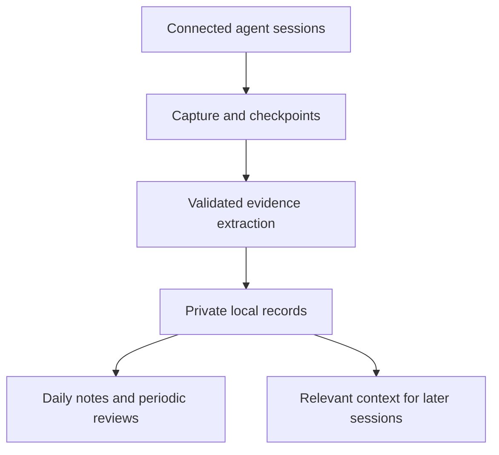

# Engineering Development Workspace

Turn everyday AI-assisted work into a clearer understanding of what you know, what you are learning, and what to practice next.

This project is a personal engineering journal and development workspace. Its intended workflow captures learning evidence from connected AI sessions, organizes it into concise daily notes, and uses that history to support reflection, focused practice, and continuity across sessions.

**Status:** assisted journal CLI with Codex transcript preview, bounded text selection, validation, recoverable receipts, and a restricted Codex adapter. A single Linux runtime has passed a manual compatibility smoke review; live activation still requires per-machine review and a private approval record. Broader semantic evaluations and macOS live verification remain pending. Automatic capture, coaching, context retrieval, and weekly/monthly reviews are still planned. The full MVP is not complete and no release has been published. The project name is still being decided.

## Why I’m building this

I started working in software development with little day-to-day technical guidance. Much of what I learned came from solving real problems as they appeared. That gave me practical experience, but it also left questions that are difficult to answer alone:

- Am I understanding the underlying concepts, or becoming familiar with a particular solution?
- Where am I improving, and what evidence supports that?
- Which recurring difficulties deserve focused study?
- Could I have reached a better conclusion through a different reasoning process?
- What should I practice next?

Conversations with friends, peers, and mentors are an important part of how I learn. I want a place to examine my work, recognize progress, and organize my questions so those ongoing conversations have useful context. Keeping a record of my reasoning and uncertainties can help me discuss ideas, seek feedback, and reflect on different perspectives.

The inspiration is partly the habit of reflection found in Marcus Aurelius’s *Meditations*: return to your actions, examine your judgment, and decide how to improve. Here, that reflection centers on engineering decisions and learning. Progression systems in RPGs offer another influence: make growth visible through meaningful challenges and milestones.

I am building this for my own use first, and sharing the software so other developers can adapt it to their goals. Its value should come from useful feedback and better understanding, with evidence behind both.

## What the experience should look like

You work with a connected agent as usual. You ask questions, investigate failures, consider alternatives, and implement changes. The integration records relevant evidence and updates your notes without requiring you to remember an end-of-day writing ritual.

The daily note gives you a short overview. Expandable sections preserve the reasoning needed to understand your decisions and revisit your learning. You can add your own reflection at any time; when it is absent, the system says so.

Weekly reviews help choose one or two practical learning actions. Monthly assessments compare evidence over time and revisit your priorities. Later sessions can retrieve relevant goals, decisions, and reviewed lessons from the same private workspace.

The intended cycle is:

**Work → capture evidence → reflect → practice → revisit the evidence.**

## Try the offline journal

The `init`, `import-records`, `render`, and `status` commands manage a private
directory and normalized evidence. The `journal` command can read saved Codex
session transcripts locally for an explicitly selected date across all local
repositories, with session exclusions and optional repository filters. Preview
does not call a model or write to the workspace. Reimporting identical evidence is
safe; conflicting identities are reported instead of silently replaced.

From this checkout, use Python >=3.10 on Linux/macOS:

See the [installation and live setup guide](docs/installation.md) for saved login,
machine defaults, runtime review, missing approval files, and repeated daily runs.

```bash
python3 -m venv .venv
source .venv/bin/activate
python -m pip install .
meditations --help
```

Local verification currently uses Linux and Python 3.10.12. The journal and manual
extraction changes passed the Linux/macOS CI matrix on Python 3.10 and 3.14.
Those checks do not verify live model execution. Prefer a supported Python release
for regular use.

Create a disposable example workspace outside the checkout:

```bash
MEDITATIONS_DEMO_DIR="$(mktemp -d)"
export MEDITATIONS_DEMO_DIR
meditations init --workspace "$MEDITATIONS_DEMO_DIR/notes" --timezone America/Sao_Paulo
python - <<'PY'
import json
import os
from pathlib import Path

demo = Path(os.environ["MEDITATIONS_DEMO_DIR"])
workspace_id = json.loads((demo / "notes/workspace.json").read_text())["workspace_id"]
records = [json.loads(line) for line in Path("examples/records.jsonl").read_text().splitlines()]
for record in records:
    record["workspace_id"] = workspace_id
(demo / "input.jsonl").write_text("".join(json.dumps(record) + "\n" for record in records))
PY
meditations import-records --workspace "$MEDITATIONS_DEMO_DIR/notes" --input "$MEDITATIONS_DEMO_DIR/input.jsonl"
meditations render --workspace "$MEDITATIONS_DEMO_DIR/notes"
meditations status --workspace "$MEDITATIONS_DEMO_DIR/notes"
```

Import reports `{"created": 3, "unchanged": 0}`; running it again reports
`{"created": 0, "unchanged": 3}`. Two daily notes appear under
`$MEDITATIONS_DEMO_DIR/notes/engineering/daily/`: `2026-10-03.md` and
`2026-10-04.md`, connected by task links. No login or inference is required.
The [sample daily note](examples/daily-note.md) shows the synthetic output.

Offline rendering without a current composition separates a short reading view
from complete supporting evidence.
The overview shows at most five tasks, using a recent summary with decisions or
results when available. Each task highlights at most five distinct recorded
decisions, results, and verification entries, with attribution and links to their
evidence. These entries are historical reports, not an inferred final task status.
Learning topics show up to five frequently recorded concepts. Generic reflection
questions help you start your own writing; they do not assess mastery.

Expand a task's evidence section to see every active record, including full
summaries, reasoning, alternatives, uncertainties, provenance, and omitted details
from the short view. Technical caveats are retained there rather than repeated as
an unbounded list of open questions. This is deterministic selection and formatting
of stored evidence, not an additional model-generated thematic synthesis or study
resource search. Reformatting stored records needs no inference.

Live `journal` adds a daily composition step over **all active evidence** for the
date. The [daily journal template](docs/architecture/daily-note-template.md) follows
an editorial structure: YAML metadata, one introduction, a brief overview, topical
reasoning, open issues, guided study, specific reflection questions, and protected
personal writing. Topics can use paragraphs, bullets, steps and comparison tables.
Record IDs, attribution fields and record-by-record dumps stay in private JSON.
Internal source citations are validated and retained in composition receipts;
they do not establish that an interpretation is correct.

Known limitation: related-day navigation uses dates present in stored evidence.
It can skip existing handwritten notes and link to an older day. Selecting the
most recent related existing note remains a follow-up fix.

Extraction can retain public study URLs appearing exactly in cited source text.
Composition can use those recorded resources with explanations and reading questions;
it does not browse, invent links, or claim to have verified them. Older records with
no resources need transcript re-extraction to recover discarded links. The
[synthetic example](examples/daily-note-target.md) illustrates the delivered structure.

Composition uses the same restricted Codex transport, with one additional call
per changed evidence/settings fingerprint, a 64 KiB complete submitted-text limit,
and a 180-second timeout. Oversized or invalid composition preserves the previous
note. `compositions/` stores private immutable receipts keyed by evidence, locale,
model, prompt/schema, and privacy settings. A private `.selected` file lets offline
rendering retain the most recently selected settings, including cache hits.
Unchanged repeated generation reuses
its composition without inference; formatting-only changes reuse it too. Concurrent
runs may consume duplicate calls, though publication is checked under a local lock.
Offline `render` reuses a current composition; it refuses to replace an existing
thematic note with an evidence-only fallback when that composition is stale.

To test a template against stored evidence without changing the daily baseline:

```bash
meditations journal --date 2026-10-06 --from-records \
  --output "$HOME/meditations-preview/2026-10-06-candidate.md"
```

`--from-records` skips transcripts and extraction. `--output` writes a separate
private Markdown candidate, copying protected handwritten text from the baseline.
Use a destination outside the public checkout and managed daily/JSON directories.
This can perform composition inference; `--dry-run` still performs no calls or writes.

Read those notes in your editor. Add reflection below the generated block and
rerun `render`; your text is preserved. Text inside the generated block is replaced.
Notes without exactly one valid pair of markers are left untouched and reported
as conflicts. Keep personal edits outside that block. Once finished, you can remove
the disposable directory printed by `echo "$MEDITATIONS_DEMO_DIR"`.

Configuration is stored in `workspace.json`; records are individual JSON files.
Generated notes support English (default) and Brazilian Portuguese using
`init --language pt-BR`, alongside Markdown callouts and Obsidian block-reference links.
Other presentation settings remain part of the full MVP. Source revisions must
use distinct record UUIDs; earlier revisions remain stored but only the latest
contributes to notes. Correct records by importing a new revision rather than
editing generated sections.

## Preview and test manual extraction

Supply a normalized conversation with explicit message roles, IDs, task metadata,
and aware occurrence times. The [synthetic input](examples/conversation.json)
shows the format. Each unit covers one task/day; automatic segmentation and history
capture are still pending.

```bash
meditations extract --workspace "$MEDITATIONS_DEMO_DIR/notes" \
  --input examples/conversation.json --dry-run
```

Preview makes no model call or writes. Add `--show-payload` only when you want the
submitted source and initial instructions printed to your terminal. Missing source
times require an explicit `--occurred-at '2026-10-03T12:00:00-03:00'` override;
records disclose that the original time is unavailable.

## Configure a default vault on each machine

After initializing a private workspace, select it once on each machine:

```bash
meditations configure --workspace "/path/to/your/vault"
```

This saves the resolved absolute path in machine-local settings and leaves the
vault unchanged. The default settings file is `~/.config/meditations/config.json`
on Linux (`$XDG_CONFIG_HOME/meditations/config.json` when set), or
`~/Library/Application Support/meditations/config.json` on macOS. Keep this file
local: the same synchronized vault can have different paths on different machines.
It contains the default workspace and optional runtime approval paths, not
credentials or the approval record itself.

Save the approval record's location once, either alongside `--workspace` during
setup or separately after selecting a vault:

```bash
meditations configure --runtime-approval "$HOME/.config/meditations/runtime-approval.json"
meditations journal --date 2026-10-06
```

The path is expanded and saved as an absolute path. The file can be created after
configuration; saving its location does not create or approve it. Live processing
still validates the record on each run. `--runtime-approval PATH` on `journal` or
`extract` overrides the saved location without updating it. Changing the workspace
preserves the approval path; changing the approval path preserves the workspace.
Existing machine configurations without this setting continue to work with an
explicit runtime approval option. Dry runs do not validate an approval record.

Other commands can now omit `--workspace`, including daily processing, dry runs,
rendering, imports, and status. An explicit `--workspace` overrides the default for
that command without changing it. Run `configure` again to select another default.
Without a valid configured default, pass `--workspace` explicitly; the CLI never
chooses the current directory as a vault automatically.

```bash
meditations journal --date 2026-10-06 --dry-run
meditations status
```

Initial setup still needs an explicit path for `init` when no default exists.
`configure` validates an already initialized workspace; it does not create one or
activate model execution. Live daily processing uses the global Codex model by
default, supports `--model` as an override, and still requires a runtime approval.

The default model is the top-level `model` setting in `$CODEX_HOME/config.toml`
or `~/.codex/config.toml`. Meditations reads that value separately and passes it
to the restricted child process; it does not import other personal settings or
resolve project/profile model overrides. Missing or invalid model settings produce
an actionable error; explicit `--model` bypasses this lookup. Dry runs do not need
a model. Python 3.11+ uses the standard TOML parser. Python 3.10 uses `tomli`, which
is currently pinned in the development environment; promoting it to the runtime
dependencies remains pending approval.

## Create or update a day from Codex sessions

This command discovers root Codex session JSONL files under `$CODEX_HOME/sessions`
or `~/.codex/sessions`. By default it selects supported sessions across all local
repositories, using message event timestamps in the workspace timezone. A session
started on an earlier date can contribute to the selected day after it is resumed.
This reads saved conversations, not repository files. Only sessions available on
this machine can be selected; scheduling and automatic cross-machine collection
remain pending.

```bash
meditations journal --workspace "$MEDITATIONS_DEMO_DIR/notes" \
  --date 2026-10-06 --dry-run
```

Optionally repeat `--repo /path/to/project` to narrow the selection. Each filter
must match the session's resolved working directory exactly; subdirectories and
similar-looking names are not implicitly included. No repository filter is needed
for the default daily journal, including sessions from directories no longer present.

To opt a session out of future processing, add its ID (shown in preview) to the
private `workspace.json` configuration's `excluded_session_ids` list. Existing
workspaces without the field default to an empty list. For example, add this field
alongside the existing workspace identity, timezone, and other settings:

```json
"excluded_session_ids": ["session-id-to-skip"]
```

Repeat `--exclude-session SESSION_ID` for additional exclusions on one invocation.
Both lists apply even when `--repo` narrows the selection. Excluded session bodies
are skipped before processing. Exclusions prevent future processing; they do not
erase evidence or notes already generated. Subagents and Meditations extraction
sessions remain excluded automatically.

Preview reports selected session/message/unit counts, omissions, and coverage
warnings without printing conversation text. Add `--show-payload` to inspect the
filtered text that would be sent. `--sessions-dir` can point to a different local
Codex session directory; it does not change authentication. Use `--json` for
machine-readable output. `init --language pt-BR` selects Brazilian Portuguese for
generated labels and model output; existing workspaces keep their configured
language unless an explicit conflicting value is supplied.

The reader supports root session metadata plus timestamped `response_item` text
messages and textual function/custom tool outputs. It ignores mirrored event
messages, instructions, reasoning, images, and tool invocation objects. A selected
transcript is limited to 64 MiB and parsed lines to 2 MiB. Larger entries are
skipped with an `oversized_line` omission and a coverage warning; their date, type
and content remain unknown. Later messages retain their original source line IDs.
A malformed complete line within the limit fails selection, while an incomplete
final line is omitted with a coverage warning. A changing or truncated transcript
asks you to retry. The initial adapter
uses the JSONL shape observed with Codex CLI 0.160.0; other versions are reported
but are not guaranteed to have complete coverage. Extraction units are limited to
64 KiB and 200 messages; `--max-units` defaults to 10. Preview shows when the
selected batch exceeds that run limit. A current-day session's earlier messages
are not added as context.

Without `--dry-run`, the command processes the selected day using the global Codex
model (or a `--model` override) and a private runtime approval file. This path sends
selected text to the
model service and writes validated evidence plus the requested daily note. It stops
on the first failed unit, reports partial progress, and does not render an
incomplete day. The CLI compares source and extraction settings to stored receipts,
reuses unchanged units, and automatically advances internal revisions for changed
units. No manual `--revision` is needed. Per-machine review remains required; follow the
[extraction compatibility gate](docs/architecture/extraction.md) before any live
use. Once that gate has been completed and separately approved, the command shape is:

```bash
meditations journal --workspace "$MEDITATIONS_DEMO_DIR/notes" \
  --date 2026-10-06 \
  --runtime-approval "$HOME/.config/meditations/runtime-approval.json"
```

Existing manually composed Obsidian pilot notes are not adopted automatically.
Notes without valid generated markers are preserved and reported as conflicts; use
a separate pilot workspace or an unused date when first validating generation. A
preview does not prove that every activity from the day was captured.

### Repeated runs and multiple machines

The daily note is a view of the private evidence store. Repeating an unchanged
session/day material with the same extraction settings reuses its receipt, makes
no new model call, and preserves handwritten reflection. New activity or changed
settings receives a new internal revision automatically. The generated section
combines active evidence from all sessions; a changed unit replaces its earlier
version rather than appending duplicate summaries. Historical records remain stored.
If the note is missing, available evidence creates it, even when its original
transcripts are no longer on this machine. No relevant source or stored evidence
means no new note, with a visible `no-evidence` result.

For sequential work/home runs, synchronize the same private workspace, including
`workspace.json`, `records/`, `extractions/`, `compositions/`, and `engineering/`. After the work
run, sync to home before processing the home machine's sessions. The renderer
then combines both machines' available evidence into the same daily note. Sync
the result before running again on the other machine. Raw Codex transcripts,
credentials, runtime approval files, and machine-local installation state do not
need to be synchronized. Keep this private workspace separate from the public
software repository.

Synchronizing only Markdown is insufficient: regenerating the generated section
from an incomplete local evidence store can remove another machine's contribution.
Receipts without their referenced records cause an error. Concurrent runs or Git
merges can produce conflicts; automated synchronization and conflict reconciliation
are not implemented. The CLI does not fetch, commit, or push the vault.

Try the full pipeline with a fixed synthetic provider, without login/inference:

```bash
MEDITATIONS_EXTRACTION_DEMO="$(mktemp -d)"
python scripts/offline_extraction_demo.py \
  --workspace "$MEDITATIONS_EXTRACTION_DEMO/notes"
```

The resulting `engineering/daily/2026-10-03.md` contains one finding. Repeating
this demo reuses its receipt and evidence. This verifies integration, not model
quality. Inspect the temporary directory before removing it manually.

Real model execution additionally requires an available global Codex model or a
`--model '<approved-model>'` override, and a private `--runtime-approval` capability
record. A Linux compatibility smoke review has been completed for one development
setup; other installations still need the
[documented gate](docs/architecture/extraction.md). Broader semantic evaluations
and macOS live verification remain pending. A runtime approval is an
operator attestation, not a sandbox. Login does not imply unlimited usage.

Known sensitive literals can be supplied through a private JSON-list
`--redact-file`; recognized credential patterns are also filtered. These controls
do not guarantee confidentiality. No input path, raw transcript, or prompt is saved
in extraction receipts. Provider inference sends selected material off the machine.

Extraction stores supported evidence and reports unresolved messages. Run
`meditations render` separately after inspecting its status. Reusing identical
input/settings makes no model call. The daily `journal` command manages revisions
automatically; the lower-level `extract --input` command still validates the source
revisions declared in its normalized input file.
An empty new revision can supersede older findings while preserving history.
Interrupted record publication can resume without another model call. There are at
most two attempts per unit, with no automatic retry for authentication, refusal,
rate limits, timeout, or incomplete output.

See the [extraction contract](docs/architecture/extraction.md) and
[synthetic evaluation set](evals/extraction/README.md). Evaluation annotations await
owner review; no live semantic results or model comparison are claimed.

## Command reference

```bash
meditations --help
meditations journal --help
```

| Command | Purpose |
| --- | --- |
| `init` | Initialize the private workspace |
| `configure --workspace /path/to/vault` | Save this machine's default workspace |
| `configure --runtime-approval /path/to/record.json` | Save this machine's runtime approval location |
| `journal` | Process local sessions and create or update the selected daily note |
| `journal --dry-run` | Preview session selection without model calls or writes |
| `extract` | Process an explicitly supplied normalized conversation into evidence |
| `extract --dry-run` | Preview that normalized input without model calls or writes |
| `import-records` | Import already normalized evidence |
| `render` | Reuse current cached composition or format evidence offline |
| `status` | Inspect record counts and note conflicts |

The installed `meditations` executable is registered in [pyproject.toml](pyproject.toml).
Command routing lives in [cli.py](src/meditations/cli.py); the daily command and its
arguments live in [journal.py](src/meditations/journal.py).
Machine-local defaults live in [machine_config.py](src/meditations/machine_config.py).

## Delivery plan

The goal is a journal that helps you remember your work, revisit your reasoning,
and write your own reflection. The complete learning workspace remains the vision;
the first usable delivery focuses on an assisted journal.

| Delivery | Intended behavior |
| --- | --- |
| Assisted journal | Supply session material manually, obtain grounded daily Markdown, understand processing results, and add protected personal reflection |
| Daily automation | Capture available activity and generate daily notes without routine commands, with recovery and safe synchronization |
| Complete learning workspace | Receive integrated evidence-linked reviews, reviewed memory, contextual coaching, and continuity across sessions |

If extraction fails validation, the run keeps the existing note and reports the
application-generated rejection reason. Its single repair attempt receives that
reason; pasted notes and terminal output retain user-report attribution.
Composition resource failures identify the learning/resource field, a redacted URL,
and whether the URL is duplicated, absent from evidence, or present only outside
that learning item's explanation citations. Relevant record IDs and a URL
fingerprint help locate the mismatch; `--json` exposes these fields under
`composition_error`. Credentials, query strings, fragments, invalid URLs and
control characters are withheld from resource diagnostics. Failed responses are
not saved as valid compositions. These diagnostics do not recover the rejected
URL from an earlier run that only reported the generic error.

Composition failures now save a private, bounded report in
`diagnostics/composition/YYYY-MM-DD.json`: the latest failure for that day,
its timestamp, evidence fingerprint, call counts, redacted details, and available
composition usage. `status` lists these reports; dry-run shows the selected day's
report as historical and indicates whether its evidence still matches. Reports
are retained after successful runs as historical information, not a verdict on
the next run. Previous failures from versions without reporting cannot be recovered.
No raw conversation or rejected full model response is saved in the report.

For inspection without inference or writes:

```bash
meditations journal --date 2026-10-06 --from-records --dry-run
meditations status
```

Dry-run shows extraction payload bytes, current stored composition bytes and the
64 KiB limit. Byte counts exclude runtime-added context and are not token or
subscription-quota estimates. Maximum attempts is a pessimistic bound before
receipt reuse. Composition uses compact JSON without dropping fields or values.
Normal runs stop before extraction when the current filtered stored evidence
already exceeds the composition limit. Updated extraction can still grow a day
past the limit; that is checked again before composition inference. Resolving an
already oversized day requires changing the composition budget strategy or
explicitly revising evidence; repeating the same run will not resolve it.
Unchanged completed extraction receipts are reused; changed units are re-extracted
in full, and composition processes the full active day's evidence. Repeated runs
while a session is growing can therefore incur substantial calls. Extraction has
at most one repair attempt per unit; composition has no automatic retry. A stored
failure report is informational and does not trigger inference or automatic retry.

The initial pilot still requires live extraction validation and journal usability
review. You can manually supply selected notes to an external assistant for weekly
or monthly feedback; Meditations does not yet implement those reviews.

The complete vision includes:

| Capability | What you should be able to do |
| --- | --- |
| Automatic Codex capture | Work normally while new activity is processed; pause recording or exclude projects when needed |
| Daily Markdown journal | Read concise task sections, expand reasoning and evidence, and add a personal reflection that survives regeneration |
| Weekly and monthly reviews | Follow conclusions back to evidence, choose focused practice, and compare understanding over time |
| Contextual coaching | Choose Balanced, Focus, or Study mode during connected sessions |
| Continuity across sessions | Bring relevant goals, decisions, and reviewed lessons into later Codex sessions |
| Configurable presentation | Choose language, timezone, naming, tags, links, and expandable formatting, including an Obsidian preset |
| Linux/macOS and synchronized records | Use home and work installations with user-managed synchronization, deduplication, and visible conflicts |

The core will be a **Python command-line application**. Codex hooks and scheduled workers invoke it automatically; terminal commands also provide setup, processing status, retries, and manual reviews. You mainly interact with the resulting Markdown and coaching in Codex.

The selected initial inference route uses your **existing Codex login** through noninteractive Codex execution. Its authentication, unattended behavior, model availability, and usage limits still require verification. A separate API key is not an MVP requirement; saved login does not imply unlimited usage or access to every model.

Off-topic archiving, browser ChatGPT capture, additional integrations, dashboards, embeddings, and gamification remain outside this release. Incidental unrelated content in Codex sessions is excluded from engineering records and assessments.

## Understanding is the goal

The journal should preserve the technical concepts behind the work: the problem, assumptions, alternatives, trade-offs, and reasons for a decision. A line-by-line reconstruction of code is usually unnecessary for that purpose.

For example, a database migration record might discuss referential integrity, compatibility during deployment, and rollback strategy. It should explain why those concepts mattered and what understanding you demonstrated.

The system must distinguish these situations:

| Evidence | What it supports |
| --- | --- |
| The agent explains a concept | Learning material was available |
| You explain it in your own words | Evidence of conceptual understanding |
| You apply it successfully with guidance | Evidence of supported application |
| You diagnose a failure or apply it in a new context | Evidence of diagnosis or transfer |

A question can be thoughtful verification, curiosity, or a possible gap. The system should investigate the distinction rather than automatically judge it. Likewise, a lack of new evidence should not be reported as a lack of improvement.

## Notes that stay manageable

Daily synthesis is the default. Several sessions can contribute to the same day’s engineering note, with separate sections for distinct tasks.

Related questions stay with their context. If a database task leads to questions about architectural design, both belong in the engineering record. Later discussions of the same task can be linked across daily notes.

Relationships connect the history through task identifiers, section-level tags, and concept links. Recurring concepts can receive synthesis notes when useful.

### Illustrative daily entry

> **Database restructuring:** Compared migration approaches and explored referential integrity. Compatibility during deployment remains an open question.
>
> **Concepts:** Referential integrity, backward-compatible migrations
>
> **Tags:** database, architecture
>
> **Next learning action:** Explain what happens if the migration is interrupted between stages.

<details>
<summary>Reasoning and learning evidence</summary>

- **Context:** A structural change needed to preserve existing application behavior.
- **Reasoning:** Considered sequencing changes so older and newer application versions could coexist.
- **Attribution:** The agent introduced one migration approach; the user identified a compatibility concern.
- **Evidence:** The concern appeared before implementation. No completed migration or test result was available.
- **Uncertainty:** Rollback behavior was discussed but not demonstrated.

</details>

This is a synthetic example, not a record of actual work. Expansion format, links, tags, and filenames are configurable.

## Your directory, your tools

The first storage target is a local directory containing Markdown notes and structured evidence records. You decide where that directory lives and how to read or synchronize it.

Obsidian is an intended presentation option, with a locally configured preset for links and collapsible details. A text editor should also be sufficient. The initial workflow should not require a specific notes application or a hosted database.

An illustrative layout:

```text
<selected-directory>/
  profile/
  engineering/
    daily/
    reviews/
    concepts/
  records/
```

Work and personal installations can contribute to the same workspace through user-managed synchronization. Synchronizing files and installing the integration are separate operations. The application must reconcile available contributions, prevent duplicates, and preserve handwritten content. Conflicting edits should be surfaced rather than silently overwritten.

## Feedback that respects the work

Three coaching modes are planned:

| Mode | Intended behavior |
| --- | --- |
| Balanced | Brief feedback relevant to the current task; deeper learning in reviews |
| Focus | Defer coaching while continuing evidence recording |
| Study | More explanations, Socratic questions, and exercises |

Reviews should connect conclusions to supporting evidence, acknowledge uncertainty, and propose a small number of actionable priorities. Exercises need observable completion criteria: explain a trade-off, diagnose a failure, or demonstrate a behavior.

The workspace supports ongoing learning through conversations with friends, peers, and mentors. You can choose to share a concise review, your interpretation, and focused questions to discuss your reasoning and hear other perspectives. You decide what to share and with whom; sharing is not automatic.

## How the integration is intended to work

Codex is the first integration target. Agent-specific adapters isolate lifecycle events and conversation formats from the rest of the application.



Short lifecycle handlers checkpoint pending work. A worker processes new material, validates model output, and persists evidence. Ordinary application code renders the notes. Scheduled reconciliation and startup recovery handle pending work when the environment becomes available.

Skills guide the agent’s workflow; they do not independently provide scheduling or model execution. The core is a Python CLI targeting Linux and macOS, with existing Codex authentication as the selected inference route. The exact installation package, supported Python/Codex versions, and unattended execution behavior remain to be validated.

### Efficiency from the beginning

| Work | Intended executor |
| --- | --- |
| Checkpoints, deduplication, file writes, links, and rendering | Ordinary code |
| Topic classification and structured evidence extraction | A lower-cost model |
| Weekly and monthly assessment | A more capable model |
| Selected extraction failures or ambiguities | Bounded repair or escalation when justified |

Process new material incrementally instead of repeatedly summarizing the full history. Reuse cached daily composition when its evidence and settings are unchanged.
Deterministic rendering remains available without inference.

Model selection should follow evaluations of attribution, conceptual completeness, topic boundaries, and uncertainty—not just fluent prose. Usage and latency should be measured. A stronger review model cannot recover evidence that extraction discarded.

## Privacy and assessment boundaries

The public repository contains software and synthetic examples. Your profile, notes, assessments, and credentials belong outside it.

Conceptual recording should minimize unnecessary code, identifying details, and confidential implementation information. The integration should avoid making additional raw transcript copies by default. Filtering and abstraction cannot guarantee perfect confidentiality, so uncertain passages should be omitted or marked as reduced evidence.

Local files do not imply local inference. The configured provider determines what material is submitted for processing; that behavior must be documented before use. Existing agent history has its own retention behavior.

Stored conversations and retrieved notes are treated as data. Embedded instructions must not change recording policies or trigger actions.

Assessments describe available evidence. They are not certifications of competence or comprehensive judgments of professional ability. Users must be able to correct records, disagree with interpretations, pause capture, and exclude material. Durable profile conclusions remain reviewable candidates before adoption.

## Development roadmap

These are construction milestones, not release claims. Records/rendering and
evaluated extraction support the assisted journal; capture and safe installation/
synchronization support daily automation; context/coaching/reviews complete the
learning workspace. A records-only demo remains an intermediate checkpoint:

- [x] Local configuration, evidence records, and deterministic daily rendering (offline slice; broader presentation settings remain pending).
- [ ] Evaluated extraction, configurable model roles, and usage reporting.
- [ ] Codex capture, durable checkpoints, and reconciliation.
- [ ] Installation/update behavior and cross-machine conflict handling.
- [ ] Selective context retrieval, coaching modes, reviewed memory, and evidence-linked weekly/monthly reviews.

Future possibilities include additional agent and storage adapters, richer visualizations, and optional gamification grounded in demonstrated milestones.

The priority is a reliable feedback loop before expanding integrations or adding progression mechanics.

The [learning workspace architecture](docs/architecture/learning-workspace.md) documents delivery scope, component boundaries, evidence contracts, recovery, privacy, and acceptance criteria. Temporary implementation plans and handoffs remain local. The open-source license remains to be selected before release.

## Development

Activate the project environment, then install the pinned development tools and
the editable package:

```bash
python -m pip install -r requirements-dev.txt
python -m pip install --no-build-isolation -e .
ruff check .
ruff format --check .
pyright
pyright --pythonplatform Linux
pyright --pythonplatform Darwin
pytest
python -m build --no-isolation
```

Explicit platform checks catch platform-dependent type errors even from a Linux
checkout. They do not emulate macOS processes or filesystems; the CI matrix still
executes the tests on real Linux and macOS runners.

Tests use temporary workspaces and synthetic evidence. Distribution artifacts
include reusable source and public documentation; the local handoff, credentials,
and user records must stay excluded. Notable changes are recorded in
[CHANGELOG.md](CHANGELOG.md). The journal and manual extraction changes passed the
GitHub CI matrix; live provider compatibility and semantic quality remain unverified.

## Contributing

The repository follows the documentation approach used in the owner's The Archives project: keep the README accurate to delivered behavior, maintain durable architecture documentation, and record notable changes in an `[Unreleased]` changelog as implementation begins. Temporary agent plans and private runtime data stay outside version control. Public examples and evaluation fixtures use synthetic data.

The [versioning policy](docs/architecture/versioning.md) explains the Keep a
Changelog structure, Semantic Versioning for releases, and Python development
versions. A merged PR is not a release; changes remain under `[Unreleased]` until
an explicitly approved release is prepared.

While the interfaces are evolving, useful contributions include synthetic evaluation cases, discussions of learning and assessment, reproducible synchronization failures, and feedback on note readability.

Please use synthetic or deliberately sanitized examples in public issues. Avoid uploading employer conversations, credentials, or private professional records.

Contributions should explain the problem they address, how the change supports learning or reliability, and how its behavior can be evaluated. Claims about model quality should include representative examples and known limitations.

## What success looks like

After using the workspace, you should be able to answer:

- What have I understood more deeply?
- Which evidence demonstrates that change?
- What remains uncertain?
- What should I practice next?

Those answers are the reason for building the project.
